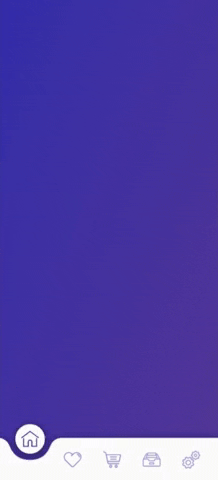

# BottomMenuAnimated
Menu inferior com animação de transição entre telas. Ícones encontrados em https://www.flaticon.com/

Responsivo enquanto o SVG do Menu couber na tela, atualmente é o equivalente a mais ou menos 860px de largura.

## Antes de usar
Remova a classe .fakeViewportLimit e coloque overflow: hidden; e position: relative; no body ou no parent element que se encaixar melhor no seu projeto.

## Preview

Confira também em: https://codepen.io/emanuelpna/pen/LYYMROa